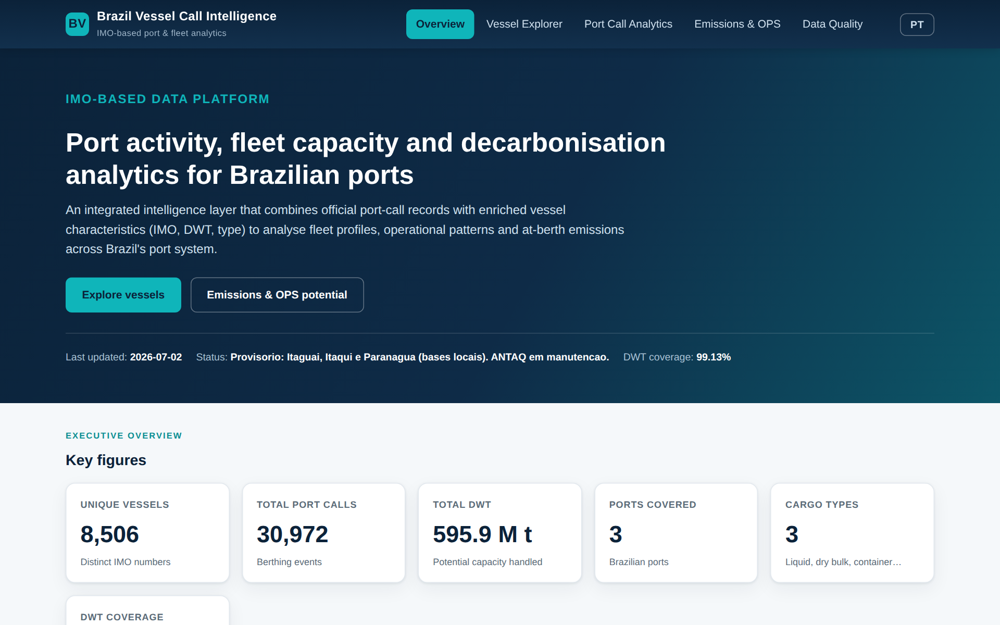
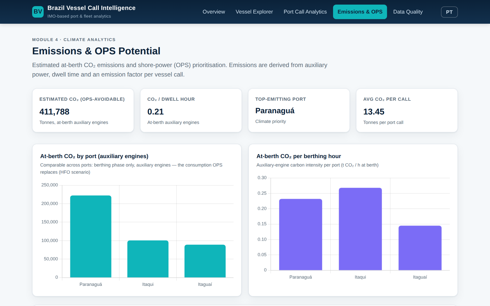
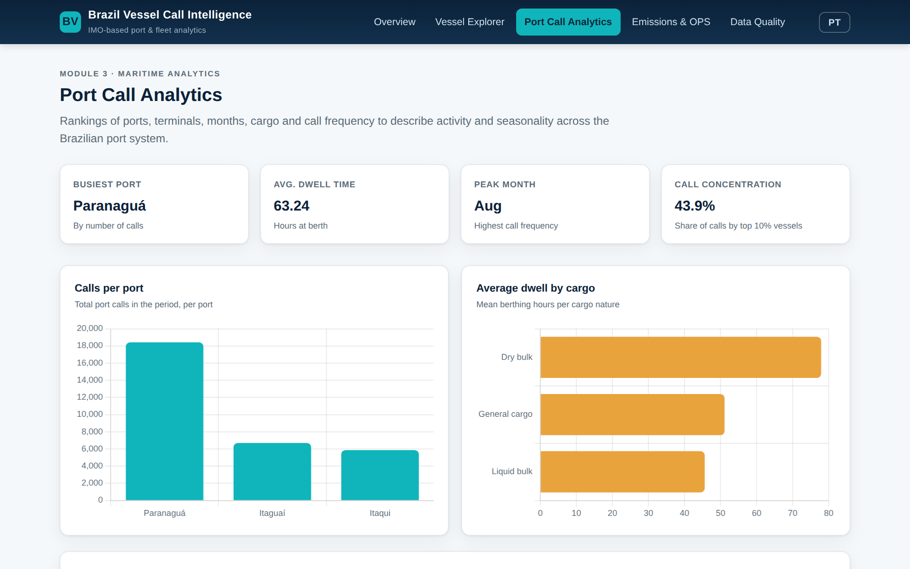
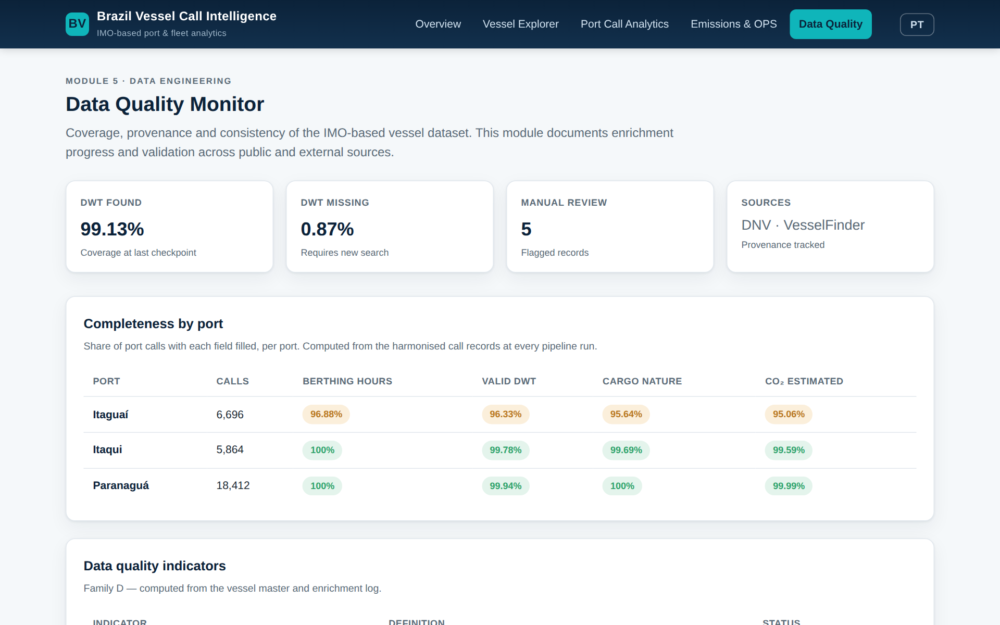

# Brazil Vessel Call Intelligence

**IMO-based port-call, fleet and at-berth emissions analytics for Brazilian ports: 30,972 port calls, 8,506 vessels, 2019 to 2025, benchmarked against the EU MRV fleet**

[](https://doi.org/10.5281/zenodo.21144511)
[](LICENSE)
[](index.html)

<p align="center">
  
</p>

## What this is

An integrated intelligence layer that joins port-call records from three Brazilian ports (Paranaguá, Itaqui and Itaguaí) with enriched vessel characteristics (IMO number, deadweight, ship type), and derives fleet profiles, operational patterns, at-berth CO₂ estimates and EU ETS exposure. Everything is published as five static HTML pages with the data embedded, so the site runs without a server and can be opened from disk.

| Key figure | Value |
|---|---|
| Port calls (berthing events) | 30,972 |
| Unique vessels (distinct IMO numbers) | 8,506 |
| DWT coverage after enrichment | 99.13% |
| Estimated at-berth CO₂ (auxiliary engines, OPS-avoidable) | 411,788 t |
| Average CO₂ per call | 13.45 t |
| Brazilian fleet also present in the EU MRV 2024 file | 4,407 vessels (51.8%) |
| Of which subject to the EU ETS | 3,821 vessels, 12.85 Mt ETS-scoped CO₂, €1.03 bn at full obligation |

Data status (July 2026): three of twenty ports, from local port bases, while the ANTAQ national base was under maintenance. The remaining ports enter when the national extract is available again.

## Modules

| Page | Module | What it shows |
|---|---|---|
| `index.html` | Overview | Executive figures, fleet size classes, calls per port and per month |
| `vessel-explorer.html` | Vessel Explorer | Search any of the 8,506 vessels by IMO or name; type, DWT, calls, ports, estimated CO₂ |
| `port-call-analytics.html` | Port Call Analytics | Busiest port, average dwell time (63.2 h), peak month, call concentration (top 10% of vessels = 43.9% of calls) |
| `emissions.html` | Emissions and OPS potential | At-berth CO₂ by port and per berthing hour, shore-power prioritisation, EU ETS exposure of the fleet |
| `data-quality.html` | Data Quality Monitor | Coverage per field and per port, provenance of enrichment sources, records flagged for manual review |

The interface is bilingual (English and Portuguese, toggle in the header).

## Gallery

| Emissions and OPS potential | Port call analytics |
|---|---|
|  |  |
| **Data quality monitor** | |
|  | |

## Method notes

- At-berth CO₂ follows the activity-based approach of the IMO Fourth GHG Study (2020): auxiliary-engine power by size class × load factor × hours at berth × SFOC × carbon factor. Boilers are excluded, so the figure is the OPS-avoidable share. The same method is packaged in [maritimeco2](https://github.com/darlianecunha/maritimeco2).
- Vessel characteristics were enriched from public sources (DNV Vessel Register, VesselFinder); every field carries provenance in the Data Quality module.
- The European benchmark joins the Brazilian fleet to the EU MRV 2024 public file by IMO number; medians of CO₂ per nautical mile and per transport work are compared by ship type.
- EU ETS exposure prices the MRV field "CO₂ to be reported under Directive 2003/87/EC" at €80 per allowance; phase-in 40% (2024), 70% (2025), 100% (2026 onwards).

## Reproducing

The published pages are single-file bundles. The source app (`app/` with `assets/`, `data/` and the page templates) lives outside this repository because it contains the consolidated port bases, which are not redistributed. `build_standalone.py` documents how the bundles are produced:

```bash
python3 build_standalone.py    # rebuilds the five HTML files from app/ and validates the embedded JS with node --check
```

To view: open any HTML file directly in a browser, or `python3 -m http.server`.

## Repository map

| Path | Content |
|---|---|
| `index.html`, `vessel-explorer.html`, `port-call-analytics.html`, `emissions.html`, `data-quality.html` | The five self-contained pages (Chart.js from CDN) |
| `build_standalone.py` | Bundler: inlines CSS, data and logic into each page |
| `docs/gallery/` | Screenshots used in this README |

## Related projects

- [brazilportdata.com](https://www.brazilportdata.com): hub of Brazilian port data projects (movements, berthings, top-20 ports, Brazil–Europe port hubs)
- [antaq-port-sql](https://github.com/darlianecunha/antaq-port-sql): reproducible SQL warehouse mirroring the ANTAQ microdata
- [shipping-carbon-costs](https://github.com/darlianecunha/shipping-carbon-costs) and [shipping-methane-monitor](https://github.com/darlianecunha/shipping-methane-monitor): the EU MRV side of the benchmark

## How to cite

Metadata in [`CITATION.cff`](CITATION.cff).

> Cunha, D. R. (2026). *Brazil Vessel Call Intelligence: IMO-based port-call and emissions analytics for Brazilian ports, 2019–2025* (Version 1.0) [Software and dataset]. Zenodo. https://doi.org/10.5281/zenodo.21144511

## Author and licence

**Darliane Ribeiro Cunha, PhD**. [ribeirocunha.com](https://ribeirocunha.com) · [ORCID 0000-0003-2548-1237](https://orcid.org/0000-0003-2548-1237)

Code and site: [MIT](LICENSE). Port-call data: provided by the port authorities and ANTAQ under their own terms; aggregated indicators only are published here.
